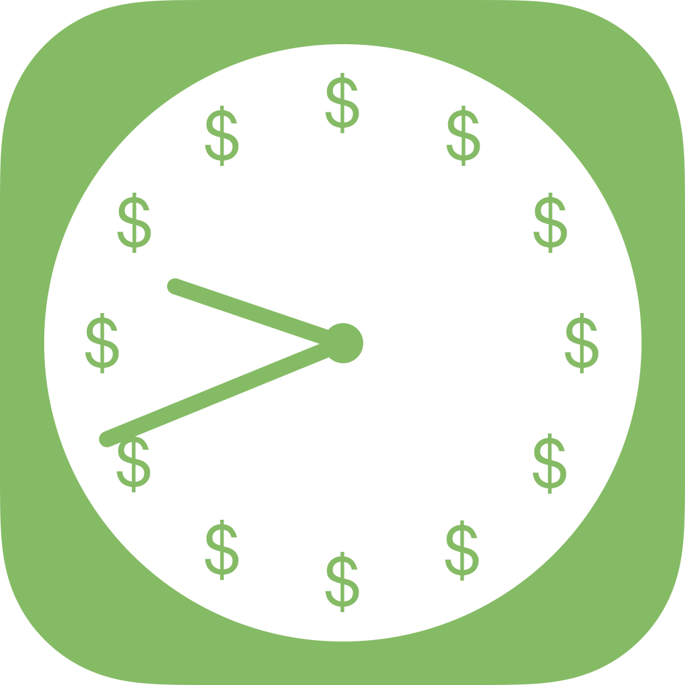
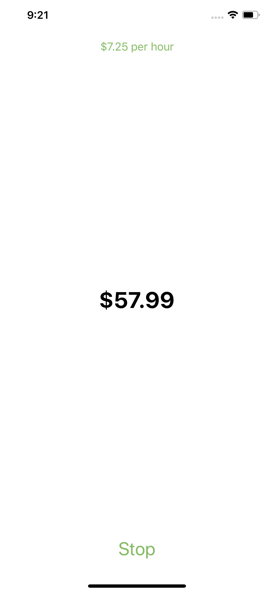
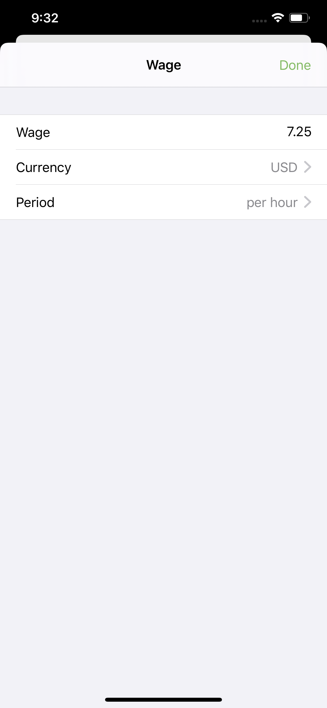

Wage Watch
==========

Time is money, as the saying goes, and Wage Watch is here to make the conversion easier! Wage Watch functions similarly to a normal stopwatch—but instead of showing the time that has elapsed, Wage Watch shows the money you have earned. Wage Watch uses your wage and pay period to show the dollars and cents as they tick up. Start Wage Watch at the beginning of your shift—or at the beginning of the year—and you'll always have a grasp on the value of your time and your money!

Wage Watch can show results in every major world currency, and supports hourly, weekly, monthly and yearly pay periods. Wage Watch will continue accurately tracking the money you've earned even when Wage Watch is closed or your device is turned off.

